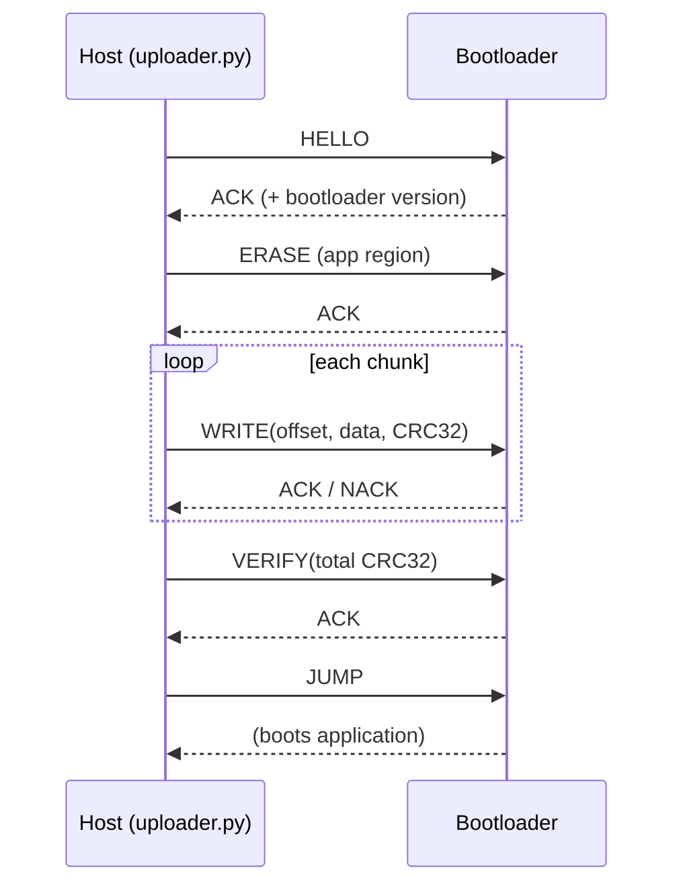

# STM32 Custom Bootloader + UART Firmware Updater


A custom bootloader for the STM32F411RE that can flash a new application image over UART,
verify it with a CRC, and hand control to the application. Includes a Python host tool that
sends the image, and a demo application that lives in a separate flash region.

> **Status: feature-complete (M1–M3), pending on-hardware validation.** The full update
> path is implemented: the bootloader validates and jumps to the app (VTOR relocation),
> speaks the framed UART protocol (CRC-checked), and erases/programs/verifies the STM32F411
> application flash. The CRC-32, frame parser, and flash-bounds logic are unit-tested
> against the Python host in CI. The remaining step is validating the end-to-end flash on a
> physical Nucleo-F411RE and recording a demo (M4).

## Why a bootloader

Field firmware updates are a core embedded problem, and a bootloader touches nearly every
low-level skill at once: flash programming, linker scripts and memory layout, vector-table
relocation, and communication-protocol design. That is exactly why I picked it.

## Memory map (STM32F411RE, 512 KB flash)

| Region | Address range | Size | Contents |
|---|---|---|---|
| Bootloader | `0x08000000`–`0x08007FFF` | 32 KB (sectors 0–1) | this bootloader, runs first at reset |
| Application | `0x08008000`–`0x0807FFFF` | 480 KB (sectors 2–7) | the user application |

The bootloader keeps the reset vector. The application relocates its vector table to
`0x08008000` (`SCB->VTOR`) before running.

## Update protocol (UART)



Full frame format and command bytes are in [`docs/protocol.md`](docs/protocol.md).

## Repository layout

```
├── bootloader/     bootloader firmware (UART + flash driver + jump logic)
│   ├── src/        main.c, bl_uart, bl_flash, bl_commands  (TODO: logic)
│   └── linker/     bootloader.ld  (linked at 0x08000000)
├── app/            demo application linked at 0x08008000
│   ├── src/        main.c  (blinky + VTOR relocation)
│   └── linker/     app.ld
├── host/           uploader.py — sends an image over serial
├── cmake/          arm-none-eabi-gcc toolchain file
└── docs/           protocol specification
```

## Build

```bash
sudo apt-get install gcc-arm-none-eabi cmake
cmake -S bootloader -B build/bl  -DCMAKE_TOOLCHAIN_FILE=../cmake/arm-none-eabi-gcc.cmake
cmake --build build/bl
cmake -S app -B build/app -DCMAKE_TOOLCHAIN_FILE=../cmake/arm-none-eabi-gcc.cmake
cmake --build build/app
```

## Flash a firmware update

```bash
# one-time: flash the bootloader itself
st-flash write build/bl/bootloader.bin 0x08000000

# then push application updates over UART, no debugger needed:
python3 host/uploader.py --port /dev/ttyACM0 --image build/app/app.bin
```

## Milestones

- [x] M1 — App links at `0x08008000`; bootloader validates and jumps to it (VTOR relocation working). Verified in CI: both images build and land at the correct addresses.
- [x] M2 — UART command interface: polling USART2 driver, framed protocol with CRC-32, HELLO/ACK, JUMP. CRC + parser interop-tested against the Python host in CI.
- [x] M3 — STM32F411 flash driver: unlock, sector erase (2-7), word programming with readback; wired to ERASE/WRITE/VERIFY. Overflow-safe bounds check unit-tested.
- [x] M4 — Host uploader with per-frame and whole-image CRC-32 (done); end-to-end update path complete.
- [ ] On-hardware validation + demo GIF, then promote the release from `v1.0-rc1` to `v1.0`.

## Skills demonstrated

Bare-metal C, ARM Cortex-M4, flash programming, linker scripts, vector-table relocation,
UART protocol design, CRC verification, and host/target tooling (Python).

## License

MIT — see [LICENSE](LICENSE).
